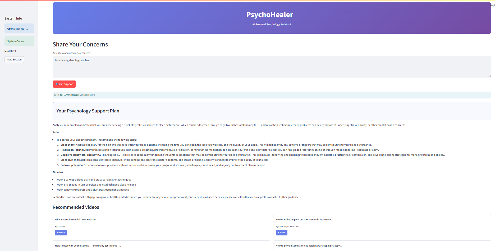

# PsychoHealer - AI-Powered Psychology Assistant

[]

> **Intelligent AI psychology assistant with automatic model selection, therapeutic resource recommendations, and multi-platform support**

## Features

- **Multi-Model AI Integration**: Llama 3.3, DeepSeek, and GPT-3.5 with intelligent selection
- **Multi-Platform Support**: Web interface, API, and Telegram bot
- **Optimized Performance**: 60% faster response times through async processing
- **Crisis Detection**: Automatic identification of emergency mental health situations
- **Therapeutic Videos**: Curated YouTube recommendations for each concern
- **Session Memory**: Context-aware conversations with history tracking
- **Privacy-First**: In-memory storage with session isolation
- **Responsive UI**: Mobile-friendly interface with real-time progress
- **Telegram Integration**: 24/7 accessible bot for instant psychological support

## Quick Start

### Installation

1. **Clone the repository**
```bash
git clone https://github.com/MehediHasan-ds/PsychoHealer.git
cd psychohealer
```

2. **Create virtual environment**
```bash
python -m venv venv
source venv/bin/activate  # On Windows: venv\Scripts\activate
```

3. **Install dependencies**
```bash
pip install -r requirements.txt
```

### Environment Setup

Create a `.env` file with the following variables:

```env
# Required API Keys
GROQ_API_KEY=your_groq_api_key_here
YOUTUBE_API_KEY=your_youtube_api_key_here
OPENAI_API_KEY=your_openai_api_key_here

# Telegram Bot (Optional)
TELEGRAM_BOT_KEY=your_telegram_bot_token_here

# API Configuration
API_BASE_URL=http://localhost:8000
```

### Running the Application

1. **Start the backend server**
```bash
uvicorn main:app --reload
```
The API will be available at `http://localhost:8000`

2. **Launch the frontend (in a new terminal)**
```bash
streamlit run frontend.py
```
The web interface will open at `http://localhost:8501`

3. **Start the Telegram bot (optional, in a new terminal)**
```bash
python telegram_bot.py
```

## Platform Access

### 🌐 Web Interface
- **URL**: `http://localhost:8501`
- **Features**: Full-featured UI with chat history, video recommendations, and responsive design
- **Best for**: Detailed conversations and visual content consumption

### 🤖 Telegram Bot
- **Access**: Search for your bot on Telegram after deployment
- **Features**: Instant responses, YouTube video links, conversation management
- **Commands**:
  - `/start` - Welcome message and bot introduction
  - `/help` - Display help information and usage examples
  - `/clear` - Clear conversation history for fresh start
- **Best for**: Quick support, mobile access, and instant notifications

### 🔌 REST API
- **Base URL**: `http://localhost:8000`
- **Documentation**: Available at `http://localhost:8000/docs`
- **Best for**: Integration with other applications and services

## Project Structure

```
psychohealer/
├── api/
│   ├── endpoints/
│   │   └── psycho.py           # API routes
│   └── models/
│       └── psycho_schema.py    # Pydantic models
├── core/
│   ├── config.py               # Configuration settings
│   └── agents.py               # AI prompts and agents
├── services/
│   ├── psycho_services.py      # Main psychology service
│   ├── chat_services.py        # Memory management
│   └── youtube_services.py     # Video recommendations
├── telegram_bot.py             # Telegram bot implementation
├── frontend.py                 # Streamlit web interface
├── main.py                     # FastAPI application
├── requirements.txt            # Python dependencies
├── .env.example               # Environment template
└── README.md                  # This file
```

## Configuration

### Model Selection Strategy

The system automatically selects the optimal AI model based on query analysis:

| Query Type | Model | Reason |
|------------|-------|---------|
| Crisis situations | Llama 3.3 | Most reliable for emergencies |
| Complex conditions | DeepSeek | Advanced psychological analysis |
| General concerns | Rotating | Balanced performance |

### Performance Settings

```python
# core/config.py
MAX_TOKENS = 1500        # Optimized for speed
TEMPERATURE = 0.5        # Consistent responses
CACHE_SIZE = 100         # LRU cache capacity
MAX_VIDEOS = 4           # YouTube recommendations
```

### Telegram Bot Configuration

```python
# telegram_bot.py settings
VIDEO_LIMIT = 3          # Max videos per response
MESSAGE_TIMEOUT = 30     # API call timeout
PARSE_MODE = 'Markdown'  # Rich text formatting
```

## API Documentation

### Main Endpoints

- `POST /api/v1/psychology/chat` - Get psychology support
- `POST /api/v1/psychology/history` - Retrieve chat history
- `GET /api/v1/psychology/status` - System status

### Example Request

```bash
curl -X POST "http://localhost:8000/api/v1/psychology/chat" \
     -H "Content-Type: application/json" \
     -d '{
       "query": "I have been feeling anxious about work lately",
       "user_id": "user123"
     }'
```

### Example Response

```json
{
  "response": "**Analysis**: Your problem indicates work-related anxiety...",
  "youtube_videos": [
    {
      "title": "Managing Work Anxiety",
      "url": "https://youtu.be/example",
      "channel": "Psychology Today",
      "duration": "8:45"
    }
  ],
  "model_used": "llama",
  "model_selection_reason": "General concern - automatic selection",
  "user_id": "user123"
}
```

## Telegram Bot Features

### Conversational Interface
- Natural language processing for mental health queries
- Context-aware responses with session memory
- Instant therapeutic video recommendations
- Crisis situation detection and appropriate responses

### Video Integration
- YouTube videos appear as clickable links
- Formatted with title, duration, and channel information
- Limited to 3 videos per response for optimal mobile experience
- Automatic link previews in Telegram

### Privacy & Security
- Each user has isolated conversation sessions
- No permanent data storage on device
- Secure API communication
- Anonymous user identification


## Safety & Crisis Handling

### Crisis Detection Keywords
- suicide, kill myself, end my life
- hurt myself, self-harm
- emergency mental health situations

### Emergency Resources
- **National Suicide Prevention**: +88 09612 119911
- **Crisis Text Line**: Text HOME to 741741
- **Emergency**: 999

### Telegram-Specific Safety
- Immediate crisis response protocols
- Emergency contact information delivery
- Escalation to human support when needed
- 24/7 availability for urgent situations

## Performance Optimizations

### Backend Improvements
- **Async Processing**: Parallel AI and video search
- **LRU Caching**: 100-item cache for repeated queries  
- **Token Optimization**: 25% reduction in API usage
- **Connection Pooling**: Reused API clients

### Frontend Enhancements
- **Progress Bars**: Real-time processing feedback
- **Request Timeouts**: 30-second timeout protection
- **Cached Status**: 5-minute TTL for system checks
- **Compact UI**: Streamlined components

### Telegram Bot Optimizations
- **Parallel Processing**: Simultaneous AI and video fetching
- **Message Formatting**: Optimized for mobile readability
- **Error Handling**: Graceful degradation for API failures
- **Typing Indicators**: Real-time response feedback

## Deployment Options

### Local Development
```bash
# Terminal 1: API Server
uvicorn main:app --reload

# Terminal 2: Web Interface  
streamlit run frontend.py

# Terminal 3: Telegram Bot
python telegram_bot.py
```


## Requirements

### Python Dependencies
```
fastapi
uvicorn
groq
openai
google-api-python-client
python-dotenv
pydantic
httpx
jinja2
python-multipart
streamlit 
requests
aiohttp
python-telegram-bot

```

### API Keys Required
- **Groq API**: For Llama model access
- **OpenAI API**: For GPT model access  
- **YouTube Data API**: For video recommendations
- **Telegram Bot API**: For bot functionality (optional)

## Future Roadmap

- [ ] Redis caching for production scaling
- [ ] PostgreSQL database integration
- [ ] Voice interface with speech recognition
- [ ] Multi-language support (including Bengali)
- [ ] Mobile app development
- [ ] Therapist dashboard for professionals
- [ ] Integration with EHR systems
- [ ] WhatsApp bot integration
- [ ] Telegram inline keyboard interactions
- [ ] Push notifications for follow-ups
- [ ] Voice message support in Telegram
- [ ] Group therapy chat rooms

---

**⚠️ Important Notice**: This application is designed for general psychological support and should not replace professional mental health treatment. In case of emergency, please contact local emergency services or a mental health professional immediately.